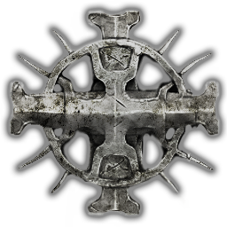

<p align="center">
  
</p>

<h1 align="center">Lords of the Fallen Archipelago</h1>

<p align="center">
  An Archipelago multiworld randomizer client and offline UE4SS mod for
  <em>Lords of the Fallen</em> (2023) on PC.
</p>

<p align="center">
  
  
  
  
</p>

This development release supports Steam build 24429019. Back up your saves,
use a new character for each seed, and never use the mod in matchmaking,
co-op, or invasions.

## Contents

- [Features](#features)
- [Requirements](#requirements)
- [Windows installation](#windows-installation)
- [Linux and Proton installation](#linux-and-proton-installation)
- [Starting and reconnecting](#starting-and-reconnecting)
- [Client commands](#client-commands)
- [Logic and safety](#logic-and-safety)
- [Crash recovery and diagnostics](#crash-recovery-and-diagnostics)
- [Building a release](#building-a-release)
- [Support and scope](#support-and-scope)

## Features

- 597 retail pre-placed world pickups, with only the tutorial Throwing Stone
  kept vanilla.
- `any_ending` and a route-safe `all_bosses` goal.
- Protected missable checks and no faction or Crucible reward checks.
- Optional Vigor Skull and weapon-upgrade smoothing.
- `/logic` for region-prefixed checks currently reachable with received items.
- Durable check replay, save rollback recovery, and room-linked logs.
- Native local-item presentation, named same-game remote items, and a
  transparent Archipelago icon for other-game items.

The release includes `lotf.apworld`, the UE4SS game mod, a commented player
YAML, Windows and Linux tools, and documentation.

## Requirements

- The Steam release of *Lords of the Fallen* on Windows 10/11, or Steam Proton
  on Linux.
- [Archipelago 0.6.7 or newer](https://github.com/ArchipelagoMW/Archipelago/releases).
- [RE-UE4SS 3.0.1](https://github.com/UE4SS-RE/RE-UE4SS/releases/download/v3.0.1/UE4SS_v3.0.1.zip).

RE-UE4SS is the open-source Unreal Engine mod loader that runs the included Lua
bridge. Download the basic `UE4SS_v3.0.1.zip` package from the official release;
do not use a source-code, `zDEV`, or experimental archive.

## Windows installation

1. Back up `%LOCALAPPDATA%\LOTF2\Saved\SaveGames`.
2. In Steam, right-click **Lords of the Fallen**, then choose
   **Manage > Browse local files**. Keep this game folder open; it contains
   `LOTF2.exe` and the `LOTF2` subfolder.
3. Open `LOTF2\Binaries\Win64` inside that game folder. Extract the *contents*
   of `UE4SS_v3.0.1.zip` directly into `Win64`:

   ```text
   Lords of the Fallen/
   `-- LOTF2/Binaries/Win64/
       |-- dwmapi.dll
       |-- UE4SS.dll
       `-- Mods/
   ```

4. Download `LotF-Archipelago-x.y.z-win64.zip` from GitHub Releases and choose
   **Extract All**. Open the extracted `LotF-Archipelago-x.y.z` folder and
   double-click **`Install-LotFArchipelago.cmd`**.
5. In the installer window:

   - select the Steam game folder from step 2; and
   - choose **Install** and wait for the progress bar to reach 100%.

6. In Archipelago Launcher, choose **Install APWorld** and select
   `lotf.apworld` from the extracted release folder.
7. Edit `Lords of the Fallen.yaml`, place it in Archipelago's `Players` folder,
   and generate a new multiworld.

The installer remembers the game folder. For later sessions,
`Start-LotF-AP.cmd` starts the game immediately without a path picker or
confirmation. `Uninstall-LotFArchipelago.cmd` removes this mod using the same
saved path. It leaves UE4SS, saves, logs, backups, and unrelated mods intact.

## Linux and Proton installation

Archipelago's Linux AppImage cannot currently install custom APWorlds. Use an
Archipelago 0.6.7+ source checkout, extract
`LotF-Archipelago-x.y.z-linux.zip`, and run:

```bash
bash ./install-apworld.sh --archipelago-path "$HOME/src/Archipelago"
bash ./install-lotf-archipelago.sh \
  --game-path "$HOME/.local/share/Steam/steamapps/common/Lords of the Fallen"
```

The installer saves the game location. Subsequent starts and uninstallations
do not require `--game-path`:

```bash
bash ./start-lotf-ap.sh
bash ./uninstall-lotf-archipelago.sh
```

If Proton is not detected, pass `--proton /path/to/proton` and, when needed,
`--compat-data /path/to/compatdata/1501750`. Client and Proton bridge data use
`${XDG_STATE_HOME:-$HOME/.local/state}/LotFArchipelago` by default.

## Starting and reconnecting

Use this order for every session:

1. Open **Lords of the Fallen Client** in Archipelago Launcher.
2. Connect to the correct room and slot.
3. Run `Start-LotF-AP.cmd` on Windows or `start-lotf-ap.sh` on Linux.
4. Wait for the client to report `Game bridge connected`.
5. Load the seed's character and wait for save synchronization before moving
   or collecting anything.

The launcher starts the shipping executable with Easy Anti-Cheat and the
Redpoint EOS multiplayer subsystem disabled while preserving the full game's
Steam AppID (`1501750`). The bridge also switches the game's own online mode,
crossplay, and invasions settings off. Keep Steam running and signed into the
account that owns the full game. At the main menu, confirm that the game
reports offline status before loading the character; if it reports online,
close it rather than continuing the modded session.

If the client closes while the game remains open, stop collecting checks,
reopen the client, and reconnect to the same room and slot. Continue only after
bridge and save synchronization complete. Use `/resync` if the client requests
it.

If the game displays Friend's Pass, close it, confirm the Steam account owns
the full game, verify the game files, start the unmodded full game once, and
then retry the provided launcher. Do not create `steam_appid.txt`.

## Client commands

| Command | Result |
| --- | --- |
| `/bridge` | Shows mod/package versions, connection state, and pickup-safety profile. |
| `/logic [page or area]` or `/inlogic` | Lists reachable unchecked locations, 30 per page. An area prefix such as `/logic AR` filters the list. |
| `/resync` | Starts measured inventory reconciliation after a crash, rollback, or paused grant. |
| `/save_slot <0-99>` | Selects a save slot when automatic save detection is ambiguous. |
| `/diagnostics` | Appends a room-linked diagnostic summary to the log. |

Boss checks are sent by soulflaying their remembrance stigmas. `/logic`
describes check locations, not the items placed there.

## Logic and safety

Every eligible pre-placed pickup is identified by its retail persistent GUID,
prepared before interaction, and correlated with its generated Archipelago
location. The Defiled Sepulchre tutorial Throwing Stone remains untouched so
hanging corpses are always accessible.

Physical pickup GUIDs are mapped to cooked gameplay sublevels and the same
region graph drives generation and `/logic`. The default upgrade counts provide
one normal +10 weapon set, all 20 Sanguinarix materials, and all three lamp
upgrades. Smoothing can bias low-value Vigor Skulls and Small Deralium toward
early logical checks.

Advancement items unlock at least one check. Progression and broadly useful
items cannot be placed at protected missable quest checks. Faction rewards and
Crucible encounters are excluded. `all_bosses` contains only encounters that
remain available regardless of ending route and quest choices.

See [Progression and location safety](docs/PROGRESSION.md) for the advancement
list, unsafe-location rules, excluded sources, and audited boss set.

## Crash recovery and diagnostics

After a crash or older-save load, leave the client connected while the game
finishes loading. The client identifies the active save, audits inventory, and
restores only measured deficits from items the server says the slot received.
An ambiguous or unverifiable recovery stops safely for manual review.

Logs append across sessions:

- Windows: `%LOCALAPPDATA%\LotFArchipelago\logs\`
- Linux: `${XDG_STATE_HOME:-$HOME/.local/state}/LotFArchipelago/logs/`

Run `New-LotFDiagnosticBundle.cmd` on Windows or
`new-lotf-diagnostic-bundle.sh` on Linux to collect bridge logs, client logs,
launcher details, installed game identity, and UE4SS output. Add the generated
multiworld and player YAML when they are safe to share. Save files and server
passwords are excluded.

## Building a release

The version comes from `VERSION`. Both build paths produce:

- `lotf.apworld`
- `LotF-Archipelago-x.y.z-win64.zip`
- `LotF-Archipelago-x.y.z-linux.zip`

Windows:

```powershell
powershell.exe -NoProfile -ExecutionPolicy Bypass -File .\scripts\windows\Test-Repository.ps1 `
  -GamePath "<Steam game folder>"
powershell.exe -NoProfile -ExecutionPolicy Bypass -File .\scripts\windows\Build-Release.ps1 `
  -GamePath "<Steam game folder>"
```

Linux:

```bash
bash ./scripts/linux/test-repository.sh \
  --game-path "$HOME/.local/share/Steam/steamapps/common/Lords of the Fallen"
bash ./scripts/linux/build-release.sh \
  --game-path "$HOME/.local/share/Steam/steamapps/common/Lords of the Fallen"
```

See [Development](docs/DEVELOPMENT.md) for test commands and acceptance
criteria. Runtime hooks still require an offline game smoke test after game,
Proton, or UE4SS updates.

## Support and scope

The integration covers retail pre-placed physical pickups and mapped
boss/key/quest/stigma checks. Enemy drops, destructible drops, faction and
Crucible rewards, enemy placement, entrances, and online play are outside the
current scope.

For support, contact `sigmar.heldenhammer` on Discord (user ID
`307218166944104448`). Include what happened and when, a diagnostic bundle,
and, when safe, the matching generated multiworld and player YAML.

This unofficial fan project is unaffiliated with HEXWORKS, CI Games, Epic
Games, Valve/Steam, or Archipelago. Source is available under the
[MIT License](LICENSE); game artwork and trademarks belong to their respective
owners.
